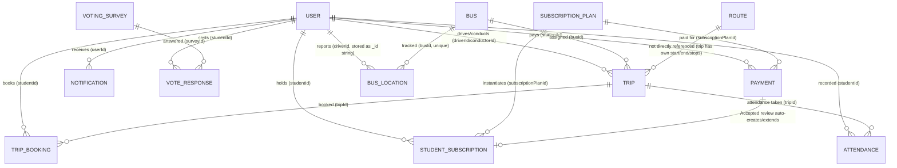

# 06 — Database Model

MongoDB via Mongoose 8.2. Connection: `MONGODB_URI` env var, wired in
`backend/src/app.module.ts:35-42`. No real Mongoose `ref:`/`populate()`
relationships exist anywhere in the codebase — every cross-collection reference is
a plain `number` field resolved manually via `Model.findOne({numericId})`. See
`04-backend-architecture.md` ("The `numericId` pattern") for why.

## Entity-relationship diagram (logical, not enforced by the DB)

## Collections

### `users` — `backend/src/modules/users/user.schema.ts`
| Field | Type | Notes |
|---|---|---|
| firstName, lastName | string, required | |
| email | string, required, **unique** | |
| password | string, required | bcrypt hash, 10 rounds |
| role | enum, required | `Admin \| Student \| Driver \| Conductor \| MovementManager` |
| phoneNumber | string | |
| nationalId | string, unique, **sparse** | students only |
| status | enum, default `Active` | `Active \| Inactive \| Suspended` |
| profilePictureUrl | string | set by upload endpoint |
| isEmailVerified | boolean, default false | |
| verificationCode / verificationCodeExpires | string / Date | 6-digit code, 24h expiry |
| resetToken / resetTokenExpires | string / Date | 6-digit code, 1h expiry |
| studentAcademicNumber, department, yearOfStudy, emergencyContact, emergencyPhone | student-only fields | not required (populated for Student role only) |
| licenseNumber, experience, assignedBusId, assignedRouteId | driver-only fields | numeric refs, no schema-level relation |
| numericId | number, unique, indexed | derived in `pre('save')` hook |

Additional index on `role`.

### `buses` — `backend/src/modules/buses/bus.schema.ts`
`busNumber` (required, unique), `speed` (required, default 0), `capacity`
(required), `status` (default `Active`, enum `Active|Inactive|
UnderMaintenance|OutOfService`), `location: {lat: Number, lng: Number}`,
`numericId` (unique, indexed).

### `trips` — `backend/src/modules/trips/trip.schema.ts`
`busId`, `driverId`, `conductorId` (all required numbers), `tripDate`,
`departureTimeOnly`, `arrivalTimeOnly` (required), `startLocation`,
`endLocation` (required), `status` (default `Scheduled`, enum
`Scheduled|InProgress|Completed|Cancelled`), embedded `stopLocations:
StopLocation[]` (each with `address`, `arrivalTimeOnly`, `departureTimeOnly`,
all required strings — sub-schema `_id: false`,
`backend/src/modules/trips/trip.schema.ts:6-18`), `bookedSeats` (default 0),
`numericId` (unique, indexed).

### `tripbookings` — `backend/src/modules/trip-booking/trip-booking.schema.ts`
`tripId`, `studentId` (required numbers), `pickupStopLocationId` (required),
`userSubscriptionId` (required), `status` (default `Confirmed`, enum
`Confirmed|Cancelled|NoShow|Completed`), `bookingDate` (default now),
`cancellationDate`, `numericId` (unique, indexed).

**Note**: also written to by the parallel `backend/src/modules/bookings/`
controller, which bypasses `TripBookingService` (see `04-backend-architecture.md`).

### `payments` — `backend/src/modules/payment/payment.schema.ts`
`studentId`, `subscriptionPlanId`, `amount` (required numbers),
`subscriptionCode` (string), `paymentMethod` (required, enum
`Offline|Online` — labels only, no gateway integration behind "Online"),
`paymentReferenceCode`, `status` (default `Pending`, enum `Pending|Accepted|
Rejected|Cancelled|Expired`), `adminReviewedById`, `reviewedAt`, `reviewNotes`,
`numericId` (unique, indexed). Indexes on `studentId`, `status`,
`subscriptionPlanId`.

### `notifications` — `backend/src/modules/notifications/notification.schema.ts`
`userId`, `title`, `message` (required), `type` (default `System`, enum
`System|Alert|Announcement|Reminder|Booking`), `createdAt` (schema-level
default, separate from Mongoose `timestamps`), `isRead` (default false),
`isDeleted` (default false, soft delete), `numericId` (unique, indexed).

### `subscriptionplans` — `backend/src/modules/subscription-plan/subscription-plan.schema.ts`
`name` (required), `description`, `price` (required), `maxNumberOfRides`
(required), `durationInDays` (required), `isActive` (default true), `numericId`
(unique, indexed).

### `studentsubscriptions` — `backend/src/modules/student-subscription/student-subscription.schema.ts`
`studentId`, `subscriptionPlanId` (required numbers), `startDate`, `endDate`
(required), `isActive` (default true), `status` (default `Active`, enum
`Active|Expired|Cancelled|Suspended|PendingActivation|PendingPayment`),
`suspendReason` (string), `numericId` (unique, indexed).

### `routes` — `backend/src/modules/routes/route.schema.ts`
`name`, `startLocation`, `endLocation`, `distance`, `estimatedTime` (all
required), `stopLocations: string[]` (default empty), `numericId` (unique,
indexed). Also exposed under `/api/TripRoutes` (duplicate surface, no separate
collection).

### `attendance` — `backend/src/modules/attendance/attendance.schema.ts`
`tripId`, `studentId` (required numbers), `status` (default `Present`, enum
`Present|Absent|Late|Excused`), `markedAt` (default now), `notes`, `numericId`
(unique, indexed).

### `voting_surveys` / `vote_responses` — `backend/src/modules/voting/voting.schema.ts`
- `VotingSurvey`: `title` (required), `description`, `createdByUserId`
  (required number), `createdByName` (string), embedded `questions:
  SurveyQuestion[]` (required — each has `questionText` required,
  `questionType` required enum `multiple-choice|yes-no|rating|text`,
  `options: string[]` default empty, `isRequired` boolean default false),
  `isRecurringDaily` (default false), `dailyOpenTime`, `dailyCloseTime`,
  `startDate`, `endDate` (plain strings, date-only), `isActive` (default
  true), `numericId` (unique, indexed). Indexes on `isActive`,
  `createdByUserId`.
- `VoteResponse`: `surveyId` (string, required), `studentId` (required
  number), `studentName`, `studentEmail`, `voteDateKey` (required — either a
  `YYYY-MM-DD` date key for recurring surveys or the literal string `'once'`
  for non-recurring ones), embedded `answers:
  {questionIndex: Number, answer: String}[]` (required), `numericId` (unique,
  indexed). **Compound unique index `{surveyId, studentId, voteDateKey}`**
  enforces one vote per student per day per survey at the database level — the
  one place in the schema layer where the DB itself enforces a business rule
  rather than application code.

### `bus_locations` — `backend/src/modules/bus-tracking/bus-location.schema.ts`
`busId` (required, indexed, and separately **unique-indexed** — one document per
bus, upserted), `latitude`, `longitude` (required), `speed` (default 0),
`driverId` (required — stores the driver's Mongo `_id` as a **string**, not a
`numericId`, inconsistent with every other collection), `isTracking` (default
true), `timestamp` (default `Date.now`). No `numericId` field — this collection
is excluded from `DbMigrationService`'s backfill list.

### `settings` — `backend/src/modules/settings/setting.schema.ts`
Singleton document: `systemName`, `logo`, `primaryColor`, `secondaryColor`,
`maintenanceMode`, `maintenanceMessage`. No `numericId` (single document, looked
up directly).

## Relationships summary (application-enforced, not DB-enforced)

| From | To | Via field | Enforcement |
|---|---|---|---|
| Trip | Bus | `busId` → `Bus.numericId` | Application lookup only |
| Trip | User (driver) | `driverId` → `User.numericId` | Application lookup only |
| Trip | User (conductor) | `conductorId` → `User.numericId` | Application lookup only |
| TripBooking | Trip | `tripId` → `Trip.numericId` | Checked at booking creation (`trip-booking.service.ts`) |
| TripBooking | User (student) | `studentId` → `User.numericId` | Application lookup only |
| Payment | User (student) | `studentId` → `User.numericId` | Application lookup only |
| Payment | SubscriptionPlan | `subscriptionPlanId` → `SubscriptionPlan.numericId` | Application lookup only |
| Payment (Accepted) | StudentSubscription | Created/extended by `PaymentService.review()` | Business logic, not a stored FK |
| StudentSubscription | User (student) | `studentId` → `User.numericId` | Application lookup only |
| BusLocation | Bus | `busId` → `Bus.numericId` | Enforced via unique index + upsert |
| BusLocation | User (driver) | `driverId` (Mongo `_id` string) | Application lookup only, inconsistent ID type |
| VoteResponse | VotingSurvey | `surveyId` → `VotingSurvey.numericId` | DB-enforced uniqueness per student/day |
| VoteResponse | User (student) | `studentId` | DB-enforced uniqueness per day (compound index) |

## Implications of the no-`ref` design

- No cascade deletes at the database level — e.g. deleting a `Bus` does not
  automatically clean up `Trip.busId` references or `BusLocation` documents. The
  admin purge feature (`admin-system.service.ts`) has to explicitly enumerate and
  delete every business collection itself for exactly this reason.
- No `populate()`-based joins — every "detail view" that needs related data
  (e.g. a booking's trip and student names) does N+1 sequential lookups in
  service code (see `TripBookingService.toViewModel()` in
  `08-business-flows.md`).
- Referential integrity bugs (orphaned numeric IDs pointing at deleted
  documents) are possible and not database-detectable; this is a
  needs-verification item for data quality over the system's lifetime.
