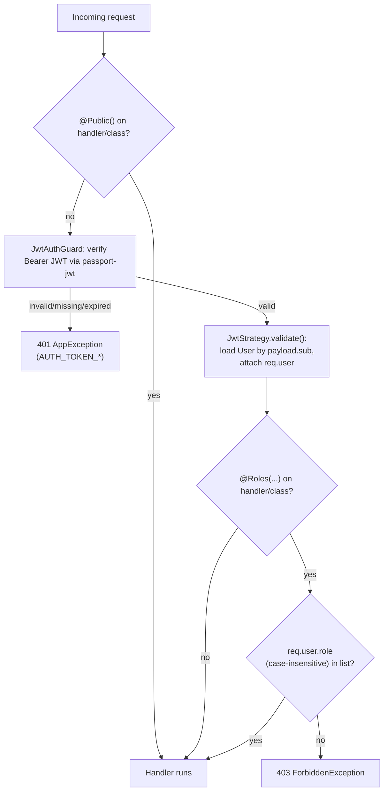

# 07 — Authentication & Authorization

## Login flow, end to end

```mermaid
sequenceDiagram
    participant U as Browser
    participant FE as Next.js (AuthProvider)
    participant BE as NestJS (AuthenticationController)
    participant DB as MongoDB (users)

    U->>FE: submit email + password
    FE->>BE: POST /api/Authentication/login {email, password, rememberMe}
    BE->>DB: findOne({email})
    alt user not found or bcrypt.compare fails
        BE-->>FE: 401 AppException(AUTH_INVALID_CREDENTIALS)
    else isEmailVerified === false
        BE-->>FE: 403 AppException(AUTH_EMAIL_NOT_VERIFIED)
    else status === 'Suspended'
        BE-->>FE: 403 AppException(AUTH_ACCOUNT_SUSPENDED)
    else success
        BE->>BE: sign JWT {sub, email, role, numericId}, 7d expiry
        BE-->>FE: 200 {data: {id, profileId, token, email, fullName, role, expiration}}
    end
    FE->>FE: normalize role (Admin→admin, Conductor→supervisor, ...)
    FE->>BE: GET /api/Settings/maintenance-mode  (NOTE: stubbed locally, see below)
    FE->>U: localStorage.setItem('user'/'token'/'authToken'); document.cookie = user=...
    FE->>U: redirect to /dashboard/{role}
```

Backend: `AuthenticationController.login` (`authentication.controller.ts:16-20`,
`@Public()`) → `AuthenticationService.login` (`authentication.service.ts:42-89`).
Password check is `bcrypt.compare` (`:48`) against the stored hash
(`bcrypt.hash(..., 10)` at registration, `:114`). The JWT payload is
`{ sub: user._id, email, role, numericId }` (`:70-75`), signed with
`JwtService` configured in `authentication.module.ts:15-22` (`JWT_SECRET`,
`JWT_EXPIRATION` default `7d`). No refresh token is issued — the client holds
this one JWT until it expires or the user logs out.

Frontend: `AuthProvider.login` (`hooks/useAuth.ts:67-145`) calls `authAPI.login`
(`lib/api.ts:333-340`), maps the backend `role` string to the frontend's
internal role key via a hardcoded map (`useAuth.ts:84-91`:
`Admin→admin, Driver→driver, MovementManager→movement-manager,
Conductor→supervisor, Supervisor→supervisor, Student→student`), then
**attempts** a maintenance-mode check via `settingsAPI.getMaintenanceMode()`
(`useAuth.ts:117`) — but that function is a **hardcoded local stub** that
always returns `{ maintenanceMode: false }` and never calls the network
(`lib/api.ts:1271-1273`). This means the client-side maintenance-mode login
block described in the code comment is currently **non-functional** — every
login proceeds regardless of the real `Setting.maintenanceMode` flag in the
database. Flagged in doc 14.

On success, the session is persisted in three places:
`localStorage['user']` (full user object incl. token),
`localStorage['token']`/`localStorage['authToken']` (duplicate copies of the
same token), and a `document.cookie` `user=<url-encoded JSON>` with `Secure;
SameSite=Lax` and an expiry of 30 days (`rememberMe`) or 1 day
(`useAuth.ts:130-141`). The cookie is what `middleware.ts` reads for
route-gating (doc 03); the `localStorage` copy is what `lib/api.ts` reads to
build the `Authorization` header on every request.

## Registration flows

Two DTOs, two endpoints, both `@Public()`:
- **Student self-registration**: `StudentRegistrationDTO`
  (`dto/student-registration.dto.ts`) → `AuthenticationService.registerStudent`
  (`:91-147`). Validates password confirmation match, uniqueness of email and
  `nationalId` (both queried separately, `:96-112`), hashes the password,
  generates a 6-digit `verificationCode` (24h expiry), creates the user with
  `role: 'Student'`, `isEmailVerified: false`, then sends the verification
  email. **If the email fails to send, the just-created user is deleted**
  (`:134-144`) — registration is all-or-nothing from the caller's
  perspective, avoiding orphaned unverified accounts that can never receive
  their code.
- **Staff registration**: `StaffRegistrationDTO` — same email-uniqueness
  check, but the password is **not supplied by the caller**: every staff
  account is created with a hardcoded default password,
  `bcrypt.hash('DefaultPass123!', 10)` (`authentication.service.ts:159`).
  Role is restricted to `Admin|Conductor|Driver|MovementManager` via
  `@IsIn(...)` on the DTO (`staff-registration.dto.ts:22-25`). Same
  fail-closed email-send behavior as student registration. **No endpoint
  currently protects registration-staff behind `@Roles('Admin')`** — it is
  `@Public()` like every other route in this controller, meaning **anyone
  unauthenticated can create a Driver/Conductor/MovementManager (or Admin)
  account with a publicly-known default password**, provided they then also
  complete email verification. This is a significant finding — see doc 14
  (Critical).

## Email verification / password reset

Standard 6-digit code flows, both time-boxed and single-use (cleared to
`null` on success): `verifyEmail` (`authentication.service.ts:191-224`,
24h-issued codes), `forgotPassword`/`resetPassword`
(`:226-297`, 1h-issued reset tokens). `forgotPassword` deliberately returns a
generic success message when the email doesn't exist, to avoid leaking which
emails are registered (`:229-231`, explicit comment in code). Delivery is via
`EmailService` (`authentication/email.service.ts`), Gmail SMTP through
`nodemailer` — see doc 09.

## Authorization — guards and roles



- `JwtAuthGuard` (`common/guards/jwt-auth.guard.ts:8-44`) and `RolesGuard`
  (`common/guards/roles.guard.ts:5-28`) are both registered globally as
  `APP_GUARD` in `app.module.ts:64-65` — **every** route in the application
  is guarded by default; opting out requires the explicit `@Public()`
  decorator.
- `JwtStrategy` (`modules/authentication/jwt.strategy.ts:9-37`) extracts the
  bearer token, verifies signature+expiry against `JWT_SECRET`
  (`ignoreExpiration: false`), then re-loads the full `User` document by
  `payload.sub` on **every request** (`:22-23`) — so a user deleted or
  role-changed mid-session is immediately reflected (no stale-JWT
  authorization window beyond what's already in flight), at the cost of one
  extra DB read per request.
- `RolesGuard` only activates if a controller/handler carries `@Roles(...)`
  metadata; otherwise it's a pass-through (`roles.guard.ts:14-16`). **Most
  controllers in this codebase never apply `@Roles()`** — see doc 05's
  per-module Auth column and doc 14 for the consolidated list of
  under-restricted endpoints. The modules that *do* use `@Roles()`
  consistently are `bus-tracking`, `voting` (writes only), and
  `admin-system`.

## The admin database-purge feature — full authorization trace

This is the most sensitive endpoint in the system
(`POST /api/Admin/System/purge`, commit `6c83648`), so it's traced completely.

**Layer 1 — role gate (controller-level, class-wide):**
`AdminSystemController` (`modules/admin-system/admin-system.controller.ts:13-15`)
is decorated `@Roles('Admin')` **at the class level**, with no `@Public()`
anywhere — so the request must first pass the global `JwtAuthGuard` (valid,
non-expired JWT) and then `RolesGuard` (`req.user.role === 'Admin'`,
case-insensitive) before the handler body ever runs.

**Layer 2 — re-verify the calling admin's identity server-side:**
`AdminSystemService.purgeDatabase` (`admin-system.service.ts:59-92`) does
**not** trust `req.user` alone. It re-fetches the admin's own `User`
document fresh from the database by the id embedded in the JWT
(`this.userModel.findById(adminUserId)`, `:60`), and if that lookup somehow
fails, throws `UnauthorizedException` rather than proceeding (`:61-65`,
comment: "never proceed with a destructive operation on an identity we can't
confirm").

**Layer 3 — two independent user-supplied confirmations, both checked
server-side:**
1. `dto.confirmationPhrase` must exactly equal the constant
   `'DELETE ALL DATA'` (`:67-73`, `PURGE_CONFIRMATION_PHRASE` exported at
   `:24`) — a case-sensitive string comparison, not just a client-side UI
   gate. `PurgeDatabaseDto` (`dto/purge-database.dto.ts`) requires this as a
   non-empty string via `class-validator`, so the global `ValidationPipe`
   already rejects a missing/empty value before the service even runs.
2. `dto.password` must `bcrypt.compare` successfully against the admin's
   **current** stored password hash (`:75-78`) — the same pattern used by
   `UsersService.changePassword`. A stale or guessed confirmation phrase
   alone is insufficient; the caller must also currently know the admin's
   live password.

**Layer 4 — the delete itself is atomic where possible:**
`runPurge` (`:94-122`) opens a Mongoose `ClientSession` and wraps the delete
in `session.withTransaction(...)`. If the deployment's MongoDB doesn't
support multi-document transactions (detected via error code 20 / message
pattern matching for "replica set" et al., `isTransactionsUnsupported:124-132`
— relevant because `deploy/lib/mongo.sh` provisions a **standalone** MongoDB
instance, not a replica set), it falls back to a sequential,
explicitly-logged **non-atomic** purge (`:106-112`) rather than silently
failing. A genuine mid-transaction failure rolls back completely — "no data
was deleted" is a real guarantee in the atomic path, not just a message
(`:113-118`).

**What gets deleted vs. preserved:** every business collection
(`buses, trips, tripBookings, payments, notifications, subscriptionPlans,
studentSubscriptions, routes, attendance, votingSurveys, voteResponses,
busLocations`) via `deleteMany({})`, plus all `users` **except** the calling
admin's own document (`{_id: {$ne: adminId}}`, `:162-163`). The `settings`
collection is never touched (no model for it is even injected into
`AdminSystemService`) — confirmed by its absence from both the constructor
injections (`:36-50`) and the `businessCollections` array (`:141-154`).

**Audit trail:** a structured `logger.warn(...)` line records
`adminId, email, atomic, deleted` counts (`:83-85`) — there is no dedicated
audit-log collection in the database, so this exists only in process/systemd
logs (`journalctl`), not queryable from the app itself. Flagged as a gap in
doc 14 (destructive action has no persisted, queryable audit record).

**Frontend gating (defense in depth, not the real security boundary):**
`app/dashboard/admin/settings/page.tsx` requires the admin to type the exact
phrase `DELETE ALL DATA` (mirrored client-side constant,
`page.tsx:30`) and enter their password before the confirm button is even
enabled (`isPurgeConfirmed`, `page.tsx:68`), and guards Enter-key submission
separately from the disabled-button state per the commit message. None of
this is trusted by the backend — it is UX friction on top of the real,
server-enforced checks described above.

## Role model

Five roles, defined as a `User.role` enum
(`modules/users/user.schema.ts:20`): `Admin`, `Student`, `Driver`,
`Conductor`, `MovementManager`. The frontend renames `Conductor` to
`supervisor` for routing/labeling purposes only (`useAuth.ts:44,88`) — this
is a presentation-layer alias, not a distinct backend role. There is no
permissions/claims system beyond this single role string — authorization is
always a flat role check (`@Roles('Admin')`, `@Roles('Driver')`, etc.), never
resource-ownership-based except where individual services hand-code an
ownership check (e.g. `BusTrackingService.stopTracking` verifying
`location.driverId === driverId`, `bus-tracking.service.ts:59-61`).
