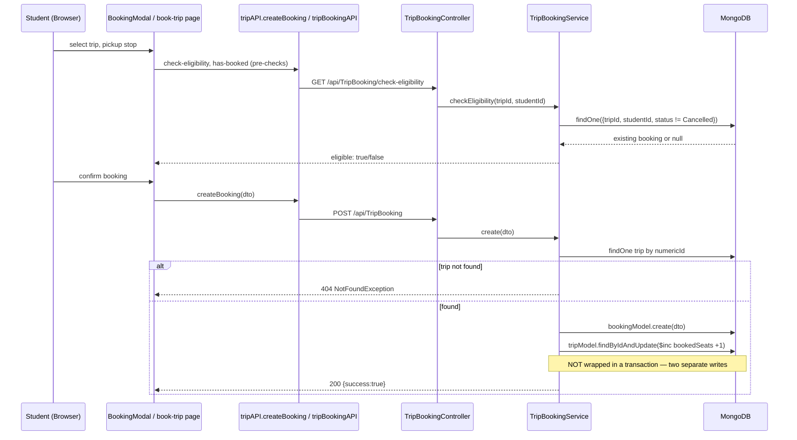
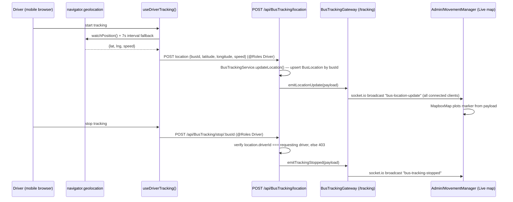
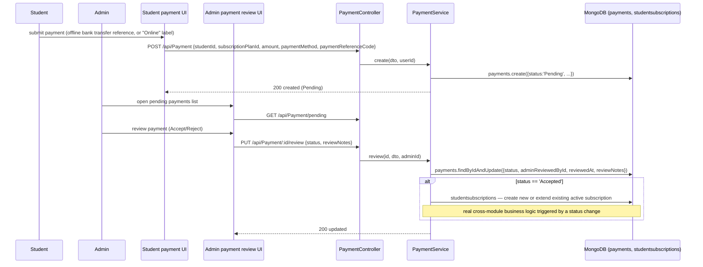
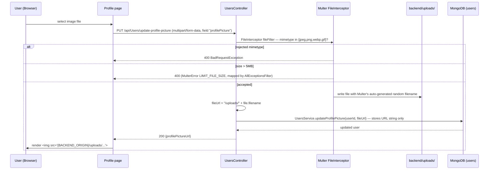

# 08 — Business Flows

Six real, traced end-to-end workflows. Login and the admin purge are diagrammed in
full in `07-authentication-authorization.md`; they are summarized again here for
completeness alongside four more domain flows.

## 1. Login (summary — full trace in doc 07)

Browser → `useAuth.login()` → `authAPI.login()` → `POST /api/Authentication/login`
(`@Public()`) → `AuthenticationService.login()` (credential check, email-verified
check, suspended check) → JWT signed with `{sub, email, role, numericId}` → stored
in `localStorage` + a `user` cookie → `middleware.ts` and `dashboard/layout.tsx`
redirect based on the cookie's `role`. See `07-authentication-authorization.md`
for the full sequence diagram and the confirmed finding that the maintenance-mode
login gate is non-functional (`settingsAPI` is a stub).

## 2. Student trip booking

Key files: `frontend/src/components/booking/BookingModal.tsx`,
`frontend/src/app/dashboard/student/book-trip/page.tsx`,
`backend/src/modules/trip-booking/trip-booking.controller.ts`,
`backend/src/modules/trip-booking/trip-booking.service.ts:48-56`.

**Confirmed risk**: `TripBookingService.create()` does two sequential writes
(insert the booking, then `$inc` the trip's `bookedSeats`) with no Mongoose
transaction — under concurrent bookings near a trip's capacity limit, this is a
potential race condition (double-booking the last seat), though there is no
capacity check against `bookedSeats` visible in `create()` at all — capacity
enforcement, if any, appears to live only in the frontend UI. This is flagged as
a likely-issue in `14-risks-observations.md`, pending a full read of any
capacity-check logic in the booking page component that might mitigate it
client-side (not a substitute for server-side enforcement).

Cancellation (`TripBookingService.cancel()`, `trip-booking.service.ts:72-84`)
mirrors this: sets `status:'Cancelled'`, decrements `bookedSeats`, again without
a transaction.

**Second write path**: the `Bookings` module
(`backend/src/modules/bookings/bookings.controller.ts`) can also create/delete
documents in the same `tripbookings` collection via direct Mongoose model access,
entirely bypassing `TripBookingService` — so seat-count and eligibility logic can
be skipped if a caller uses this path instead. See `05-api-map.md`.

## 3. Live bus tracking

Key files: `frontend/src/hooks/useBusTracking.ts:71-170`,
`backend/src/modules/bus-tracking/bus-tracking.controller.ts`,
`backend/src/modules/bus-tracking/bus-tracking.service.ts`,
`backend/src/modules/bus-tracking/bus-tracking.gateway.ts`,
`frontend/src/components/maps/MapboxMap.tsx`.

**Confirmed risk**: the Socket.IO gateway has no handshake authentication
(`cors: {origin: '*', credentials: true}`) and broadcasts to **all** connected
clients with no room/target filtering — any client that can reach the
`/tracking` namespace (not just authorized Admin/MovementManager/Driver users)
receives every bus's live location. The REST endpoints that write the location
data are role-guarded; the socket that broadcasts it is not.

## 4. Payment submission and review (subscription activation)

Key files: `backend/src/modules/payment/payment.controller.ts`,
`backend/src/modules/payment/payment.service.ts` (`review()` around lines
90-138), `backend/src/modules/payment/payment.schema.ts`.

**Confirmed risk**: `PUT /api/Payment/:id/review` has **no `@Roles()` guard** —
any authenticated user (including a Student) can call it directly against the
API, approving their own or another student's payment and triggering the
subscription-activation side effect. This is one of the highest-severity
findings in the codebase (financial/business-logic bypass) — see
`14-risks-observations.md`.

## 5. Admin database purge (summary — full trace in doc 07)

Admin types the confirmation phrase and re-enters their password in a modal on
`frontend/src/app/dashboard/admin/settings/page.tsx` →
`adminSystemAPI.purgeDatabase()` → `POST /api/Admin/System/purge`
(`@Roles('Admin')` class-level) → `AdminSystemService.purgeDatabase()` re-fetches
the admin, checks the exact confirmation phrase, bcrypt-verifies the password,
then runs a transactional (or logged non-atomic fallback) `deleteMany({})` across
12 business collections plus all users except the acting admin, preserving
`settings`. See `07-authentication-authorization.md` for the full sequence
diagram and defense-in-depth breakdown.

## 6. Profile picture upload

Key files: `backend/src/modules/users/users.controller.ts:98-120`,
`backend/src/modules/users/users.module.ts` (`MulterModule.register({dest:
'./uploads'})`), `backend/src/main.ts:46-56` (static serving at `/uploads/`
prefix).

**Confirmed characteristics**: validation is by MIME type only (no magic-byte/
content sniffing), 5MB limit, random filenames avoid path-traversal/overwrite
risk, but **no old-file cleanup** on re-upload — orphaned files accumulate in
`backend/uploads/` (and, in production, the persistent
`/var/lib/elrenad/uploads` symlink target) indefinitely. See
`10-file-uploads` coverage in `04-backend-architecture.md` and the risk entry in
`14-risks-observations.md`.
