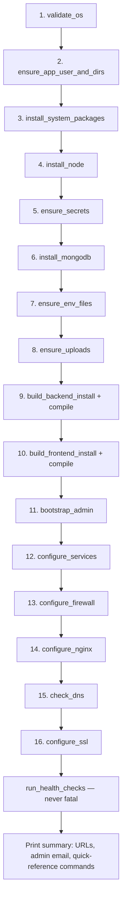

# 11 — Deployment & Infrastructure

Single-VPS deployment (Ubuntu 24.04), driven by `deploy/deploy.sh` and 16 sourced
bash modules under `deploy/lib/`. All findings below come from direct reads of
`deploy/deploy.sh`, every file in `deploy/lib/`, `deploy/backup.sh`,
`deploy/restart.sh`, `deploy/status.sh`, `deploy/logs.sh`,
`deploy/nginx/el-renad.conf.template`, `deploy/systemd/*.template`, and
`DEPLOY_VPS_AR.md`.

## `deploy/deploy.sh` — orchestrator

`set -Eeuo pipefail`, must run as root. Sets an `ERR` trap that reports the
failing stage/line/exit code and reassures the operator nothing destructive
happened — safe to just re-run. Uses `flock` on `/run/lock/elrenad-deploy.lock`
to prevent concurrent runs. Sources `config.sh`/`log.sh` then all `lib/*.sh`
modules, then runs 16 ordered stages via a `run_stage` helper:

Explicitly designed to be idempotent for both first deploy and every future
update — re-running `sudo ./deploy/deploy.sh` after a `git pull` is the
documented update procedure.

## `deploy/lib/*.sh` — module summaries

| Module | Responsibility | Notable behavior |
|---|---|---|
| `config.sh` | Shared constants, no side effects | Domains, app user/group `elrenad`, ports 7126/3000, `NODE_MAJOR=22`, `MONGO_MAJOR=8.0` with noble→jammy fallback, persistent storage paths, default admin email |
| `secrets.sh` | One-time secret generation | `/etc/elrenad/secrets.env` (mode 600); generates `JWT_SECRET`/`MONGO_APP_PASSWORD`/`ADMIN_BOOTSTRAP_PASSWORD` only if absent, never rotates existing values |
| `env.sh` | Writes `.env` files once, then additively patches | Both `_ensure_backend_env`/`_ensure_frontend_env` short-circuit file creation if the file exists — never overwrites existing lines/secrets; documents that `NEXT_PUBLIC_*` changes require a rebuild. `_ensure_backend_env` also now calls `_append_missing_backend_env_vars` on every run against an existing `backend/.env`, which appends `MAIL_FROM_NAME`/`MAIL_REPLY_TO` only if those exact keys are entirely absent from the file — existing values (including `MAIL_USER`/`MAIL_PASS`) are never touched |
| `preflight.sh` | OS/user/dir validation | Requires Ubuntu (warns, not fails, if not exactly 24.04); creates the `elrenad` system user (`--no-create-home`, `nologin`); walks up the directory tree checking traversal permissions, warning with exact fix commands rather than silently modifying parent directories it doesn't own |
| `packages.sh` | apt base packages + Node.js | `DEBIAN_FRONTEND=noninteractive`; installs curl/git/build-essential/ufw/nginx/certbot; installs Node via NodeSource, skipping if the matching major version is already present |
| `mongo.sh` | MongoDB install + lockdown | Installs MongoDB 8.0 (noble repo, jammy fallback); `_mongo_wait_ready` polls up to 30s for actual TCP-listening on 127.0.0.1:27017 (not just systemd-active, since WiredTiger recovery can lag); backs up `mongod.conf` before rewriting `bindIp` to localhost-only; creates a dedicated `elrenad_app` Mongo user scoped to `readWrite` on `bus-system` only (never superadmin), then enables `authorization: enabled` — a one-way step |
| `build.sh` | Backend/frontend build + admin bootstrap | `npm ci` (deterministic) for both apps; `nest build` then chowns `dist` to `root:elrenad` with `chmod g+rX` (service user can read, not write); frontend deletes `.next` before rebuild; invokes `bootstrap-admin.js` with secrets from `secrets.sh` |
| `services.sh` | systemd unit rendering + restart | Regenerates unit files every run via `sed` templating (cheap, keeps in sync); `daemon-reload`, enable, restart both services; on failure dumps last 40 journalctl lines and hard-fails the whole deploy |
| `firewall.sh` | UFW rules | Only touches SSH/80/443 — explicitly never MongoDB (27017) or app ports (3000/7126), which stay localhost-bound; allows OpenSSH before enabling (avoids lockout) |
| `nginx.sh` | Site render + reload | Once a cert exists, stops regenerating the config from the template (avoids clobbering certbot's SSL blocks) and just validates/reloads; only reloads Nginx after `nginx -t` passes |
| `dns_ssl.sh` | DNS check + Certbot | Detects public IP via 3 fallback IP-echo services, resolves A records for both domains; never blocks deployment if DNS is wrong (continues over HTTP with instructions); runs `certbot --nginx --redirect --non-interactive --agree-tos` only if DNS matches; enables `certbot.timer` auto-renewal; does a non-fatal `certbot renew --dry-run` sanity check |
| `healthcheck.sh` | Post-deploy verification | Never fatal to the overall script; checks systemd units, curls the public `Settings/maintenance-mode` endpoint locally as a DB-connectivity smoke test, checks frontend/Nginx/HTTPS reachability if applicable |
| `uploads.sh` | Persistent upload storage | Symlinks `backend/uploads` → `/var/lib/elrenad/uploads` so redeploys never lose files; migrates existing directory contents with `mv -n` (never overwrites) |
| `log.sh` | Logging helpers | `log_step/info/ok/warn/err`, color-coded, warnings/errors to stderr |

## Top-level operational scripts

- **`deploy/backup.sh`** — root-only; requires the secrets file to exist.
  `mongodump` against the app-scoped Mongo user (warns, doesn't fail, if
  `mongodump` is missing); `tar czf` of the uploads directory; copies both
  `.env` files if present; locks down backup dir permissions; retains only the
  most recent 14 backups. Purely read-only against the live DB. Documents (but
  never auto-runs) the `mongorestore --drop` restore procedure.
- **`deploy/restart.sh`** — root-only; restarts backend+frontend by default,
  `--all` additionally reloads Nginx (after `nginx -t`) and restarts `mongod`.
- **`deploy/status.sh`** — read-only snapshot: systemd status for
  backend/frontend/mongod/nginx, disk/memory usage, listening ports via
  `ss -ltnp`, TLS cert expiry via `openssl x509 -enddate`.
- **`deploy/logs.sh`** — thin `journalctl -u <unit> -n <lines> -f` wrapper for
  backend/frontend/nginx/mongo.

## Nginx (`deploy/nginx/el-renad.conf.template`)

Two port-80 server blocks; HTTPS blocks are appended later by certbot, not
present in the base template.
- `www.el-renad.com` → 301 redirect to the apex domain using `$scheme`.
- Apex domain block: `client_max_body_size 25m`; denies all dotfiles
  (`.env`, `.git`, etc.) via `location ~ /\.`; gzip for text/JS/JSON/XML/SVG.
  Routing, in effective priority order:
  - `/api/image-proxy` → **frontend** port (Next.js's own image-proxy route),
    placed before the general `/api/` block to win the longest-prefix match.
  - `/api/` → backend port 7126, standard proxy headers, 60s timeouts.
  - `/uploads/` → backend port, `Cache-Control: public, max-age=86400`.
  - `/socket.io/` → backend port, `Upgrade`/`Connection` headers for WebSocket
    upgrade, `proxy_read_timeout 3600s` for long-lived connections.
  - `/` (catch-all) → frontend port 3000, also with upgrade headers (Next.js
    HMR/websocket needs), 60s timeout.

**Gap confirmed**: no security headers anywhere in the template — no HSTS, CSP,
X-Frame-Options, X-Content-Type-Options, or Referrer-Policy. The only
"security" measures present are the dotfile-deny rule and (once certbot runs)
the SSL redirect certbot injects itself. See `14-risks-observations.md`.

## systemd (`deploy/systemd/*.service.template`)

Both units: `Type=simple`, run as `elrenad:elrenad`, `Restart=on-failure`
(`RestartSec=5`), `Environment=NODE_ENV=production`,
`NoNewPrivileges=true`, `PrivateTmp=true`. Neither unit uses
`EnvironmentFile=` — env vars come from `backend/.env`/`frontend/.env` being
loaded by the Node app itself.

- **Backend** (`elrenad-backend.service.template`): `After=network.target
  mongod.service`, `Wants=mongod.service`. `ExecStart=<node> dist/main.js`.
  `ReadWritePaths` explicitly grants write access to the uploads symlink target
  under the otherwise-hardened filesystem — the only such grant on either unit.
- **Frontend** (`elrenad-frontend.service.template`): `After=network.target
  <backend>.service`, `Wants=<backend>.service`. `ExecStart=<node>
  node_modules/next/dist/bin/next start -p 3000 -H 127.0.0.1` — explicitly
  binds to loopback only, consistent with Nginx being the sole public entry
  point.

## `DEPLOY_VPS_AR.md`

Arabic-language VPS deployment guide (232 lines). Structure: architecture
overview table (frontend :3000, backend :7126, local MongoDB, `elrenad`
non-root service user, Nginx + Let's Encrypt) → Phase A: first deploy on a new
server (clone repo, run `sudo ./deploy/deploy.sh`, a 1-15 walkthrough matching
`deploy.sh`'s stages, DNS setup, first login with default admin credentials
`admin@elrenad.com` / `elrenad99` and a strong warning to change it immediately)
→ Phase B: any future update (`git pull && sudo ./deploy/deploy.sh`) → daily
operational commands (status/logs/restart/backup) → troubleshooting (502 Bad
Gateway, DB connectivity, uploaded images not showing, concurrent-deploy lock,
permission-denied service failures) → security notes (MongoDB/app ports
localhost-only, non-root service user, gitignored secrets, dotfile-deny,
certbot auto-renewal). The narrative closely matches the actual script
behavior verified above — no material discrepancies found.

## Root `README.md`

Confirms production status: live transportation management platform for
el-renad.com, 5 roles (Admin, Movement Manager, Driver, Supervisor, Student),
Next.js/TypeScript frontend (i18n, multi-locale) and NestJS/TypeScript backend
"with Jest for testing." **Discrepancy noted**: `backend/package.json` has no
`test` script despite Jest being present as a devDependency — see
`12-testing.md`.

## Changelog — implementation follow-up

- Added `MAIL_FROM_NAME` (default `El Renad`) and `MAIL_REPLY_TO` (default
  empty → falls back to `MAIL_USER` at runtime) to `backend/.env.example` and
  to `deploy/lib/env.sh`'s generated `backend/.env` template, for the
  improved verification/reset email sender identity in
  `backend/src/modules/authentication/email.service.ts`. No new secret and no
  required value — the app works with both left blank. See
  `docs/email-deliverability.md`.
- No database migration was added or required for the Department list update
  — `User.department` is a free-form Mongoose `string` (no schema-level
  enum), so existing student records keep whatever value they already have,
  and the deploy pipeline's existing `DbMigrationService` (boot-time
  `numericId` backfill, unrelated to this field) needed no changes.
- No new backend dependency was introduced (email changes reuse the existing
  `nodemailer` dependency), so `build_backend_install`/`build_frontend_install`
  (`npm ci`) required no changes.

## Build & run summary

| App | Build | Run (production) |
|---|---|---|
| Backend | `npm ci` → `nest build` (→ `dist/`) | `node dist/main.js` via systemd, `HOST=127.0.0.1`, `PORT=7126` |
| Frontend | `npm ci` → `next build` (`.next/` deleted first) | `next start -p 3000 -H 127.0.0.1` via systemd |
| Reverse proxy | N/A | Nginx on 80/443, routes `/api`, `/uploads`, `/socket.io`, `/api/image-proxy`, and `/` (catch-all) to the appropriate backend/frontend port |
| Database | N/A | Local MongoDB 8.0, localhost-bound, dedicated app-scoped user, auth enabled |
