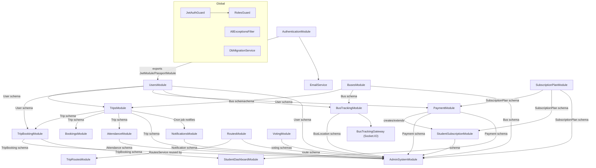

# 13 — Dependency / Relationship Map

## Backend — module coupling

## Highest fan-in files (most depended-upon)

| File | Depended on by | Why it's central |
|---|---|---|
| `backend/src/modules/users/user.schema.ts` | Nearly every module (auth, trips, payments, tracking, admin-system, student-dashboard) | The universal identity record; every role-specific field lives on one polymorphic schema |
| `backend/src/common/interfaces/api-response.interface.ts` | Every service in the codebase | `ApiResponse<T>`/`createApiResponse` is the standard response envelope used everywhere |
| `backend/src/common/exceptions/app.exception.ts` + `error-codes.ts` | Every service that throws a structured error | Central error-code vocabulary consumed by `AllExceptionsFilter` and (indirectly) by the frontend's `apiError.ts` |
| `backend/src/common/guards/jwt-auth.guard.ts`, `roles.guard.ts` | Every controller (global `APP_GUARD`) | Sole authorization enforcement point for the whole API |
| `frontend/src/lib/api.ts` | Nearly every page/component in `frontend/src/app` and `frontend/src/hooks` | The single API client surface; ~1470 lines, exports every domain API namespace |
| `frontend/src/hooks/useAuth.ts` | `layout.tsx`, every protected page, `middleware.ts`'s cookie contract | Owns the session lifecycle and the `user` cookie that gates routing |
| `frontend/src/lib/apiError.ts` | `lib/api.ts`, every form using `applyFieldErrors` | Central error-normalization/message-mapping logic |
| `frontend/src/contexts/LanguageContext.tsx` | Nearly every component (via `useI18n()`) | Primary i18n mechanism |

## Central admin-system coupling

`backend/src/modules/admin-system/admin-system.module.ts` is unusual in that it
directly imports **13 schemas from 11 other modules** (User, Bus, Trip,
TripBooking, Payment, Notification, SubscriptionPlan, StudentSubscription,
TripRoute, Attendance, VotingSurvey, VoteResponse, BusLocation) rather than
depending on those modules' services — it talks to raw Mongoose models for every
collection it purges. This makes `admin-system` the single most broadly-coupled
module in the backend (fan-out, not fan-in): any new business collection added
in the future must be manually wired into this module for the purge feature to
cover it, or it will silently survive a "delete all data" operation.

## Frontend — coupling points

- **`frontend/src/lib/api.ts`** is the dominant fan-in target — virtually all
  data-fetching in the app routes through its exported `*API` namespaces.
  `frontend/src/services/tripService.ts` is a partial, inconsistent duplicate
  of `tripAPI` for trip-specific calls.
- **`frontend/src/hooks/useAuth.ts`** and **`frontend/src/middleware.ts`** are
  coupled through an implicit contract: the shape and name of the `user` cookie
  (`useAuth.ts:141`) must match what `middleware.ts:6,27` expects — there is no
  shared type or constant enforcing this; a rename on one side silently breaks
  the other.
- **Two parallel i18n systems** (`LanguageContext`/`useI18n` vs.
  `useLanguage.ts`) are not coupled to each other — they're independent,
  duplicate implementations, not a dependency relationship.
- **`frontend/src/app/api/*`** (the legacy mock-backend tree) has essentially
  zero fan-in from the rest of the live app — it is coupled only to itself and
  to a nonexistent `db.json` file. The one exception,
  `useTripMapping.ts`'s raw `fetch('/api/Trip', ...)` call, is a
  needs-verification live coupling point worth confirming before any cleanup
  of that tree.

## Duplicate/parallel write paths (coupling risk, not architecture)

| Concern | Path A | Path B | Risk |
|---|---|---|---|
| Trip bookings | `TripBookingModule`/`TripBookingService` (validated, seat-count-aware) | `BookingsModule` (direct Mongoose model access) | Both write to `tripbookings`; Path B skips seat-count sync and eligibility checks |
| Routes | `RoutesModule`/`RoutesService` | `TripRoutesModule` (thin wrapper reusing the same service) | Not a real duplication risk (same service underneath) but a confusing duplicate API surface |
| i18n | `LanguageContext`/`useI18n` | `useLanguage.ts` | Two independent translation stores that can drift out of sync |
| Trip API client | `tripAPI` (`lib/api.ts`) | `tripService` (`services/tripService.ts`) | `tripService.create()` hand-rolls its own fetch/error-handling, bypassing the app's standardized `ApiError` normalization |

## Global cross-cutting providers (backend)

Registered once in `backend/src/app.module.ts`, affecting every request:
`AllExceptionsFilter` (`APP_FILTER`), `JwtAuthGuard` + `RolesGuard`
(`APP_GUARD`, in that order), `DbMigrationService` (runs once on boot via
`OnApplicationBootstrap`, not per-request). Any change to these four providers
has application-wide blast radius.
